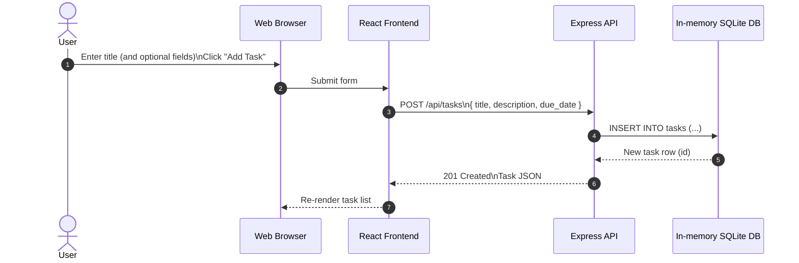

# Cloud Architecture Overview

This monorepo contains a React frontend and an Express API. The API currently uses an in-memory SQLite database (via `better-sqlite3` with `:memory:`).

## System Context

```mermaid
flowchart LR
  U[User]
  B[Web Browser]
  FE[React Frontend\npackages/frontend]
  API[Express API\npackages/backend]
  DB[(In-memory SQLite DB\n":memory:")]

  U --> B
  B -->|HTTP| FE
  FE -->|REST: /api/tasks| API
  API -->|SQL| DB
```

## Sequence: Create a TODO


